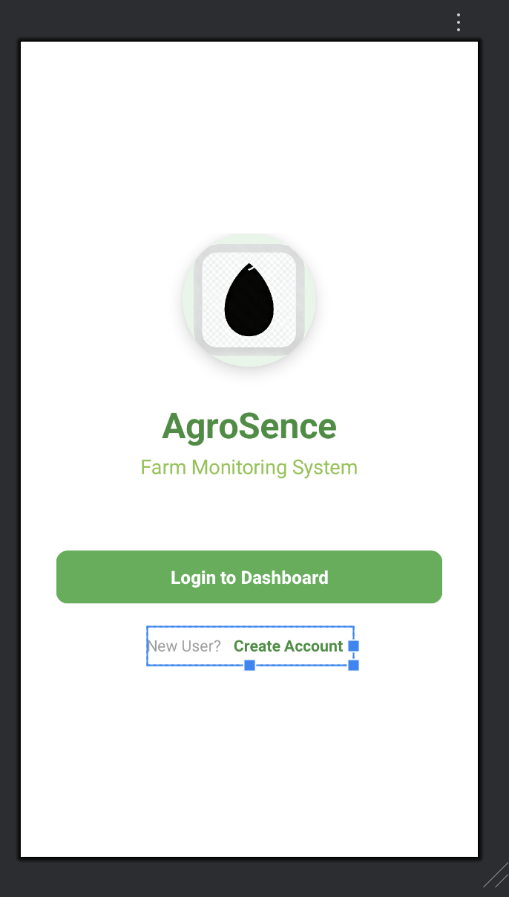
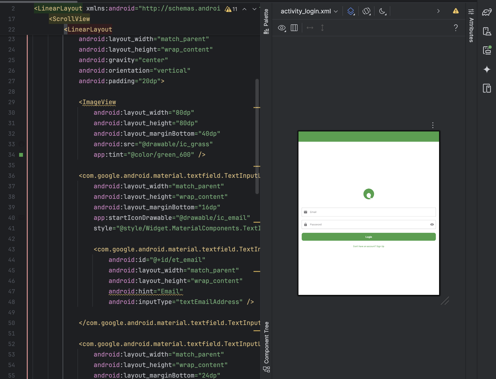
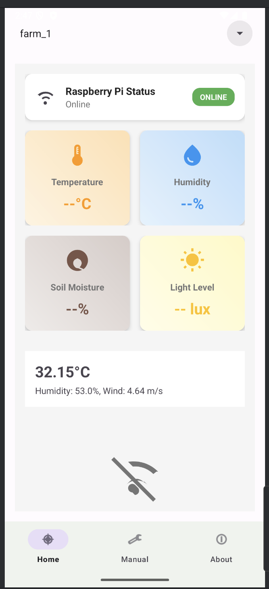
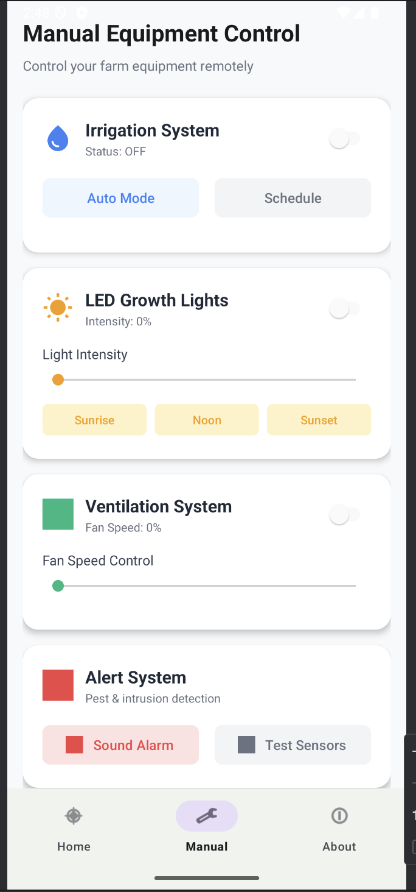
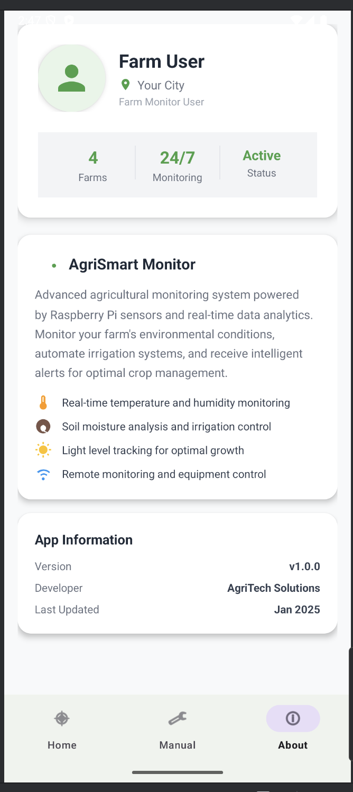

# AgriSmart Monitor 🌱

**Advanced Agricultural Monitoring System**

A comprehensive Android application for real-time farm monitoring using Raspberry Pi sensors, Firebase integration, and intelligent automation controls. Monitor environmental conditions, control irrigation systems, and receive data-driven insights for optimal crop management.

 
📱 Screenshots
🚀 Starting Screen
 A welcoming screen with animations and entry point to the app.
🔑 Login Screen
 User authentication screen supporting Firebase login and signup.
📊 Farm Dashboard
 Displays real-time environmental data such as temperature, humidity, soil moisture, and light levels.
🎮 Equipment Control
 Allows farmers to manually control irrigation, fans, and lighting with emergency stop features.
👤 User Profile
 Profile management and app details with farm statistics overview.


## ✨ Features

### 🔍 **Real-Time Monitoring**
- Temperature and humidity tracking
- Soil moisture level analysis
- Light intensity measurement
- Raspberry Pi connection status
- Weather data integration

### 🎮 **Manual Equipment Control**
- Irrigation system automation
- LED growth light intensity control
- Ventilation fan speed management
- Alert system with sound alarms
- Emergency stop functionality

### 📊 **Data Management**
- Firebase Realtime Database integration
- Multi-farm support with farm selector
- Historical data tracking
- Weather API integration (OpenWeatherMap)
- Offline data caching

### 👤 **User Experience**
- Modern Material Design UI
- Animated interactive elements
- Bottom navigation with three main sections
- User profile management
- City-based weather information

## 🏗️ Project Structure

```
app/
├── src/main/java/com/farmmonitor/agriai/
│   ├── fragments/
│   │   └── HomeFragment.java              # Farm selector and data display
│   ├── AboutFragment.java                 # User profile and app information
│   ├── FarmDataFragment.java             # Sensor data visualization
│   ├── HomeActivity.java                 # Farm selection activity
│   ├── LoginActivity.java                # User authentication
│   ├── MainActivity.java                 # App entry point and routing
│   ├── MainDashboardActivity.java        # Main dashboard with navigation
│   ├── ManualFragment.java              # Equipment control interface
│   ├── RetrofitClient.java              # HTTP client for weather API
│   ├── SensorData.java                  # Data model for sensor readings
│   ├── SignUpActivity.java              # User registration
│   ├── StartingActivity.java            # Welcome screen with animations
│   ├── WeatherApi.java                  # Weather API interface
│   └── WeatherResponse.java             # Weather data model
│
├── src/main/res/
│   ├── layout/
│   │   ├── activity_home.xml             # Farm selector layout
│   │   ├── activity_login.xml            # Login form layout
│   │   ├── activity_main.xml             # Dashboard container
│   │   ├── activity_main_dashboard.xml   # Bottom navigation layout
│   │   ├── activity_signup.xml           # Registration form
│   │   ├── activity_starting.xml         # Welcome screen with animations
│   │   ├── fragment_about.xml            # User profile layout
│   │   ├── fragment_farm_data.xml        # Sensor data cards layout
│   │   ├── fragment_home.xml             # Home fragment container
│   │   ├── fragment_manual.xml           # Equipment control layout
│   │   └── spinner_item.xml              # Custom spinner item
│   │
│   ├── menu/
│   │   └── bottom_nav_menu.xml           # Bottom navigation menu
│   │
│   ├── values/
│   │   ├── colors.xml                    # App color palette
│   │   ├── strings.xml                   # Text resources
│   │   └── themes.xml                    # App themes and styles
│   │
│   └── drawable/                         # Icons and graphics
│
├── build.gradle (Module: app)            # App-level dependencies
└── AndroidManifest.xml                   # App configuration and permissions
```

## 🛠️ Technologies Used

### **Frontend (Android)**
- **Language**: Java
- **UI Framework**: Android SDK with Material Design Components
- **Navigation**: Bottom Navigation with Fragment management
- **Animations**: ObjectAnimator and Property Animations
- **Architecture**: MVVM pattern with Fragment-based navigation

### **Backend Services**
- **Database**: Firebase Realtime Database
- **Authentication**: Firebase Authentication (with fallback hardcoded login)
- **User Storage**: Firebase Firestore
- **Local Storage**: SharedPreferences for user data caching

### **External APIs**
- **Weather Data**: OpenWeatherMap API
- **HTTP Client**: Retrofit 2 with Gson converter
- **Image Loading**: Android ImageView with tinting

### **Hardware Integration**
- **IoT Platform**: Raspberry Pi with sensor modules
- **Sensors**: Temperature, humidity, soil moisture, light level sensors
- **Communication**: Firebase Realtime Database for device communication

## 📋 Prerequisites

### **Development Environment**
- Android Studio Arctic Fox or later
- Java 8 or higher
- Android SDK API Level 21+ (Android 5.0)
- Gradle 7.0+

### **Hardware Requirements**
- Raspberry Pi 3B+ or higher
- DHT22 temperature/humidity sensor
- Soil moisture sensor
- Light-dependent resistor (LDR)
- Wi-Fi connectivity for Raspberry Pi

### **Service Accounts**
- Firebase project with Realtime Database enabled
- OpenWeatherMap API key
- Google Services configuration file

## 🚀 Installation & Setup

### **1. Clone the Repository**
```bash
git clone https://github.com/yourusername/agrismart-monitor.git
cd agrismart-monitor
```

### **2. Android App Setup**
```bash
# Open project in Android Studio
# File -> Open -> Select the project folder

# Add Firebase configuration
# Download google-services.json from Firebase Console
# Place it in app/ directory
```

### **3. Configure API Keys**
```java
// In FarmDataFragment.java, replace with your API key
private static final String WEATHER_API_KEY = "your_openweathermap_api_key";
```

### **4. Firebase Setup**
1. Create a Firebase project at [Firebase Console](https://console.firebase.google.com)
2. Enable Realtime Database with these rules:
```json
{
  "rules": {
    "farms": {
      ".read": "auth != null",
      ".write": "auth != null"
    }
  }
}
```

### **5. Build and Run**
```bash
# Build the project
./gradlew build

# Install on device
./gradlew installDebug
```

## 🔧 Configuration

### **Firebase Database Structure**
```json
{
  "farms": {
    "farm_1": {
      "temperature": 25.5,
      "humidity": 60.0,
      "soilMoisture": 45.0,
      "lightLevel": 800.0,
      "lastUpdate": 1640995200000
    },
    "farm_2": { ... }
  }
}
```

### **Default Login Credentials**
```
Email: admin@gmail.com
Password: 123456
```

## 📊 Usage

### **Getting Started**
1. Launch the app and tap "Get Started"
2. Login with provided credentials or create new account
3. Select a farm from the dropdown menu
4. Monitor real-time sensor data on the dashboard

### **Equipment Control**
- Navigate to **Manual** tab
- Toggle irrigation, lighting, and ventilation systems
- Adjust light intensity and fan speed with sliders
- Use preset lighting modes (Sunrise, Noon, Sunset)
- Access emergency stop functionality

### **User Profile**
- View user information in **About** tab
- Check app version and feature details
- Monitor farm statistics and status

## 🤝 Contributing

We welcome contributions to improve AgriSmart Monitor. Please follow these steps:

1. Fork the repository
2. Create a feature branch (`git checkout -b feature/AmazingFeature`)
3. Commit your changes (`git commit -m 'Add some AmazingFeature'`)
4. Push to the branch (`git push origin feature/AmazingFeature`)
5. Open a Pull Request

### **Development Guidelines**
- Follow Android development best practices
- Maintain consistent code formatting
- Add comments for complex logic
- Test on multiple device sizes
- Update documentation for new features

## 📝 API Documentation

### **Weather API Integration**
```java
// Weather data retrieval
WeatherApi api = RetrofitClient.getInstance().create(WeatherApi.class);
api.getWeather(cityName, apiKey, "metric").enqueue(callback);
```

### **Firebase Data Structure**
```java
// Sensor data model
public class SensorData {
    private Double temperature;
    private Double humidity;
    private Double soilMoisture;
    private Double lightLevel;
    private Long lastUpdate;
}
```

## 🐛 Known Issues

- [ ] Weather data may not load without internet connection
- [ ] Raspberry Pi connection status requires manual refresh
- [ ] Some animations may lag on older devices (API < 23)

## 🔮 Roadmap

### **Version 2.0**
- [ ] Real-time push notifications for alerts
- [ ] Historical data charts and analytics
- [ ] Machine learning predictions for crop optimization
- [ ] Multi-language support

### **Version 2.1**
- [ ] Offline data synchronization
- [ ] Custom alert thresholds
- [ ] Export data functionality
- [ ] Dark mode support

## 📄 License

This project is licensed under the MIT License -
## 👥 Authors

- ** Raj Raushan Kumar ** - *Initial work* - https://github.com/raj9097
## 🙏 Acknowledgments

- Firebase team for excellent real-time database services
- OpenWeatherMap for reliable weather data API
- Material Design team for beautiful UI components
- Raspberry Pi Foundation for affordable IoT hardware
- Android development community for continuous support

## 📞 Support

For support and questions:
- Email: rajraushankumar749@gmail.com
- GitHub Issues: [Create an issue](https://github.com/raj9097/Agriculture-Monitoring-System/issues)
- Documentation: [Project Wiki](https://github.com/raj9097/Agriculture-Monitoring-System-/wiki)

---

<div align="center">
  <strong>Built with ❤️ for sustainable agriculture</strong>
</div> 
